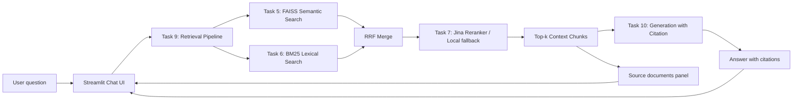

# Báo Cáo Bài Tập Nhóm - RAG Chatbot

## 1. Thông tin nhóm

| Mã HV | Họ tên | Vai trò |
|---|---|---|
| 2A202600741 | Đàm Mạnh Dũng | AI / Backend Developer |
| 2A202600846 | Nguyễn Hoàng Thanh Tùng | Tech Lead / Full-stack |
| 2A202600755 | Lê Bá Chiến | UI/UX & QA |

## 2. Phạm vi sản phẩm nhóm

Nhóm lựa chọn **Yêu cầu 1: Sản phẩm nhóm RAG Chatbot** trong README.

Sản phẩm là một chatbot tra cứu thông tin về pháp luật Việt Nam liên quan đến ma túy và các bài báo về nghệ sĩ liên quan đến ma túy. Ứng dụng sử dụng giao diện Streamlit, kết nối với pipeline retrieval và generation đã xây dựng ở các task cá nhân.

Phần **RAG Evaluation Pipeline** chưa được triển khai trong phạm vi nộp hiện tại vì nhóm tập trung hoàn thiện sản phẩm chatbot demo theo một trong hai hướng sản phẩm nhóm.

## 3. Mục tiêu

- Xây dựng giao diện chat có thể chạy local bằng Streamlit.
- Tích hợp pipeline retrieval từ các module cá nhân.
- Trả lời câu hỏi dựa trên dữ liệu đã thu thập, chuẩn hóa và index.
- Hiển thị các source documents/chunks được dùng để hỗ trợ câu trả lời.
- Hỗ trợ bật/tắt reranking và generation để demo các cấu hình khác nhau.

## 4. Dữ liệu sử dụng

### Văn bản pháp luật

Dữ liệu pháp luật được lưu tại `data/landing/legal/`, gồm 4 văn bản PDF:

- Bộ luật Hình sự sửa đổi 2017.
- Luật Phòng, chống ma túy 2021.
- Nghị định 105/2021/NĐ-CP hướng dẫn thi hành Luật Phòng, chống ma túy.
- Nghị định 28/2026/NĐ-CP về danh mục chất ma túy và tiền chất.

### Bài báo

Dữ liệu tin tức được lưu tại `data/landing/news/`, gồm 5 bài báo dạng JSON. Mỗi bài có metadata như URL gốc, tiêu đề, ngày crawl và nội dung bài viết.

### Dữ liệu chuẩn hóa

Toàn bộ dữ liệu được chuyển sang Markdown và lưu tại:

- `data/standardized/legal/`
- `data/standardized/news/`

## 5. Kiến trúc hệ thống



## 6. Thành phần kỹ thuật

| Thành phần | Công nghệ / Module | Mô tả |
|---|---|---|
| Giao diện | Streamlit | Giao diện chat, sidebar cấu hình retrieval, hiển thị hội thoại và nguồn |
| Chunking | RecursiveCharacterTextSplitter | Chia tài liệu Markdown thành các đoạn nhỏ |
| Embedding | `sentence-transformers/all-MiniLM-L6-v2` | Tạo vector embedding 384 chiều |
| Vector store | FAISS | Lưu và truy vấn dense vectors local |
| Semantic search | `src/task5_semantic_search.py` | Truy vấn theo ngữ nghĩa |
| Lexical search | `src/task6_lexical_search.py` | Tìm kiếm BM25 theo keyword |
| Fusion | RRF | Gộp kết quả semantic và lexical |
| Reranking | Jina Reranker v2 / local fallback | Sắp xếp lại kết quả theo độ liên quan |
| Generation | DashScope OpenAI-compatible API / extractive fallback | Sinh câu trả lời có citation |
| App | `streamlit/app.py` | Ứng dụng demo nhóm |

## 7. Chức năng đã hoàn thành

- Giao diện chat bằng Streamlit.
- Thanh cấu hình `Top K`, bật/tắt `Jina reranking`, bật/tắt `Qwen generation`.
- Kết nối trực tiếp với retrieval pipeline trong `src/task9_retrieval_pipeline.py`.
- Hiển thị lịch sử hội thoại trong phiên làm việc.
- Hiển thị danh sách source chunks ở cột bên phải.
- Hiển thị score, loại tài liệu và chunk index của từng nguồn.
- Có fallback extractive answer khi thiếu cấu hình LLM, giúp app vẫn chạy được khi không có API key.
- Có thể chạy local để demo trực tiếp.

## 8. Luồng xử lý chính

1. Người dùng nhập câu hỏi trên giao diện Streamlit.
2. App gọi hàm `retrieve()` trong Task 9.
3. Pipeline chạy song song hai hướng retrieval:
   - Semantic search trên FAISS.
   - Lexical search bằng BM25.
4. Kết quả được gộp bằng Reciprocal Rank Fusion.
5. Nếu bật reranking, kết quả được rerank bằng Jina Reranker hoặc fallback local.
6. Nếu bật generation, Task 10 sinh câu trả lời từ context đã retrieve.
7. App hiển thị câu trả lời và các source chunks đã sử dụng.

## 9. Phân công công việc

| Thành viên | MSSV | Nhiệm vụ | Trạng thái |
|---|---|---|---|
| Đàm Mạnh Dũng | 2A202600741 | Xử lý AI/backend, tích hợp retrieval, semantic search, lexical search, reranking và generation | Hoàn thành |
| Nguyễn Hoàng Thanh Tùng | 2A202600846 | Tech lead/full-stack, điều phối kiến trúc, tích hợp pipeline vào app, kiểm tra luồng chạy tổng thể | Hoàn thành |
| Lê Bá Chiến | 2A202600755 | Thiết kế UI/UX Streamlit, kiểm thử giao diện, kiểm tra source display và trải nghiệm demo | Hoàn thành |

## 10. Hướng dẫn chạy

Chạy từ thư mục root của project:

```powershell
pip install -r requirements.txt
```

Nếu dùng virtual environment có sẵn:

```powershell
venv\Scripts\streamlit.exe run streamlit\app.py
```

Nếu port 8501 bị chiếm:

```powershell
venv\Scripts\streamlit.exe run streamlit\app.py --server.port 8502
```

## 11. Cấu hình môi trường

Tạo file `.env` từ `.env.example` và điền API key nếu muốn dùng các dịch vụ bên ngoài:

```env
JINA_API_KEY=your_jina_api_key
DASHSCOPE_API_KEY=your_dashscope_api_key
DASHSCOPE_BASE_URL=your_dashscope_openai_compatible_base_url
DASHSCOPE_MODEL=qwen3.5-flash
```

Nếu thiếu API key, app vẫn có thể demo retrieval và fallback answer local.

## 12. Kết quả đạt được

Sản phẩm đã đáp ứng các yêu cầu chính của RAG Chatbot:

| Yêu cầu | Trạng thái | Ghi chú |
|---|---|---|
| Giao diện chat | Đạt | Dùng Streamlit |
| Trả lời có citation | Đạt một phần | Có citation khi dùng Task 10; fallback cũng gắn nguồn từ context |
| Hỗ trợ follow-up questions | Đạt cơ bản | Lưu lịch sử hội thoại trong session |
| Hiển thị source documents | Đạt | Có panel Sources hiển thị chunk, score và metadata |
| Tích hợp pipeline cá nhân | Đạt | Tích hợp Task 5, 6, 7, 9, 10 |
| Demo local | Đạt | Chạy bằng `streamlit/app.py` |

## 13. Hạn chế

- Conversation memory hiện mới lưu lịch sử trong session, chưa dùng lịch sử hội thoại làm context cho câu hỏi tiếp theo.
- PageIndex fallback đang bị tắt để tránh tiêu tốn credit.
- Chất lượng generation phụ thuộc vào API key DashScope/Qwen.
- Evaluation pipeline chưa được triển khai trong phạm vi sản phẩm nhóm hiện tại.
- Citation phụ thuộc vào metadata của chunks, nên có thể cần chuẩn hóa thêm tên nguồn để citation đẹp hơn.

## 14. Hướng phát triển

- Bổ sung memory thực sự cho follow-up question.
- Chuẩn hóa citation theo định dạng `[Tên tài liệu, Năm]`.
- Thêm bộ câu hỏi kiểm thử và evaluation tự động nếu mở rộng sang Yêu cầu 2.
- Tối ưu chunking riêng cho văn bản pháp luật để truy xuất chính xác theo điều/khoản.
- Thêm bộ lọc nguồn theo loại tài liệu: văn bản pháp luật hoặc bài báo.
- Deploy app lên cloud để demo không cần chạy local.

## 15. Checklist nộp bài

- [x] Có app chatbot Streamlit.
- [x] Có dữ liệu pháp luật và tin tức.
- [x] Có pipeline retrieval.
- [x] Có generation với citation/fallback.
- [x] Có hiển thị source documents.
- [x] Có README mô tả kiến trúc và phân công.
- [x] Chưa làm RAG Evaluation Pipeline.
